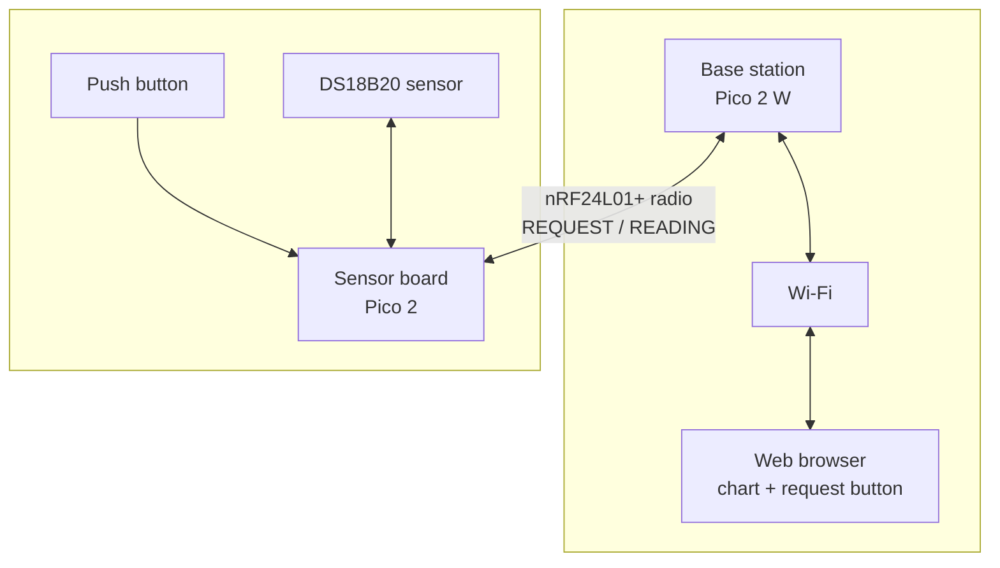
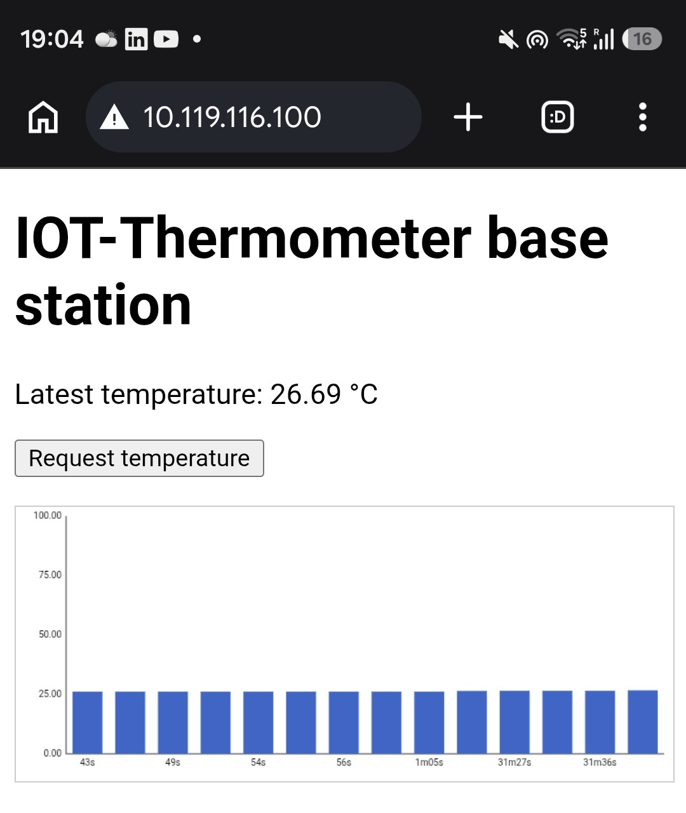
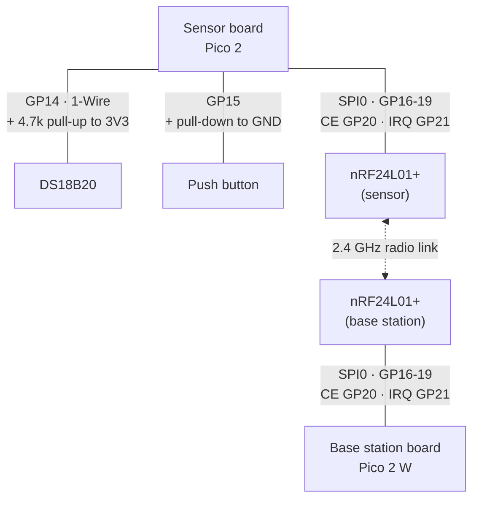

# iot-thermometer
A two-board wireless thermometer built on the Raspberry Pi Pico 2 family and FreeRTOS.




## Screenshot



## Project structure

```
iot-thermometer/
├── base_station/         Pico 2 W firmware: radio receiver, Wi-Fi, web server
│   ├── app/               Entry point (main)
│   ├── network/            Wi-Fi connection, network task, static web content (network/http/)
│   ├── temperature/        Radio receiver tasks + the temperature history ring buffer
│   ├── web/                lwIP httpd glue: SSI (live chart data) and CGI (request button)
│   └── CMakeLists.txt
├── sensor/                Pico 2 firmware: DS18B20 sensor + radio sender
│   ├── ds18b20/            DS18B20 driver wrapper + Pico-specific 1-Wire glue
│   ├── nrf24l01/            Radio sender/receiver task
│   ├── sensor.cpp           Entry point (main)
│   └── CMakeLists.txt
├── common/                Code shared by both boards
│   ├── nrf24l01/            The shared radio protocol driver (wraps external/nrf24l01)
│   ├── task_utils.*          Small FreeRTOS task-creation helper
│   ├── temperature_format.*  Shared "centi-Celsius to text" formatting
│   ├── hooks.*               FreeRTOS crash/error hooks
│   └── FreeRTOSConfig.h      Shared FreeRTOS configuration
├── external/               Vendored third-party libraries (not modified): FreeRTOS-Kernel,
│                            the nRF24L01+ driver, and the DS18B20 driver
└── docs/                  Project design documentation
```

## Hardware

- 2 × Raspberry Pi Pico boards: a Pico 2 (sensor) and a Pico 2 W (base station)
- 2 × nRF24L01+ radio modules
- 1 × DS18B20 temperature sensor
- 1 × push button
- Resistors: a pull-up for the DS18B20 data line, a pull-down for the button
- Breadboard and jumper wires

Both boards' nRF24L01+ modules are wired to the same GPIO pins, over SPI0.

### nRF24L01+ radio module (both boards)

| Signal | GPIO | Physical pin | nRF24L01+ module pin |
|---|---|---|---|
| MISO | GP16 | 21 | MISO |
| CSN (chip select, software-controlled) | GP17 | 22 | CSN |
| SCK | GP18 | 24 | SCK |
| MOSI | GP19 | 25 | MOSI |
| CE (chip enable) | GP20 | 26 | CE |
| IRQ (active-low interrupt) | GP21 | 27 | IRQ |
| 3.3 V | 3V3 (OUT) | 36 | VCC |
| Ground | GND | any GND pin (e.g. 23, 28) | GND |

The nRF24L01+ is a 3.3 V-only part. Do not power it from VBUS/VSYS. Cheap breakout modules are sensitive to supply noise; a decoupling capacitor (e.g. 10 µF) across VCC/GND close to the module is common practice and often necessary for reliable operation.

### DS18B20 temperature sensor (sensor board only)

| Signal | GPIO | Physical pin | DS18B20 pin |
|---|---|---|---|
| Data (1-Wire) | GP14 | 19 | DQ |
| 3.3 V | 3V3 (OUT) | 36 | VDD |
| Ground | GND | any GND pin | GND |

The 1-Wire data line needs an external pull-up resistor (typically 4.7 kΩ) between DQ and 3.3 V. The firmware relies on this external pull-up and does not enable the Pico's internal one.

### Push button (sensor board only)

| Signal | GPIO | Physical pin | Wiring |
|---|---|---|---|
| Button | GP15 | 20 | One side to 3.3 V, other side to GP15, with an external pull-down to GND |

The firmware watches for a *rising* edge on GP15 and does not enable an internal pull resistor, so an external pull-down is required to keep the pin low while the button is not pressed.

### Wiring diagram


## Building and flashing

The two boards are independent CMake projects. Build and flash each one separately. Both need the [Raspberry Pi Pico SDK](https://github.com/raspberrypi/pico-sdk) installed (this project auto-detects it the same way the Pico VS Code extension does, via `~/.pico-sdk`), plus CMake and Ninja.

**Sensor board** (no configuration required):

```sh
cmake -S sensor -B sensor/build -G Ninja
cmake --build sensor/build
```

**Base station board** (needs Wi-Fi credentials, see [Configuration](#configuration) below):

```sh
cmake -S base_station -B base_station/build -G Ninja \
    -DWIFI_SSID="your-network" -DWIFI_PASSWORD="your-password"
cmake --build base_station/build
```

Each build produces `build/<board>.uf2`. To flash: hold **BOOTSEL** while plugging the Pico into USB (it mounts as a drive named `RPI-RP2`), then copy the `.uf2` file onto it. The board reboots into the new firmware automatically. If [`picotool`](https://github.com/raspberrypi/picotool) is installed, `sudo picotool load -f build/<board>.uf2` works too, without needing to hold BOOTSEL first.

## Configuration

- **Wi-Fi SSID/password** (base station only): CMake configure-time flags, never hard-coded: `-DWIFI_SSID="..." -DWIFI_PASSWORD="..."`.
- **Radio channel** (both boards): `NRF24L01_TEMPERATURE_CHANNEL_FREQUENCY` in `common/nrf24l01/driver_nrf24l01_temperature.h`, 0-125.
- **Radio output power** (both boards): `NRF24L01_TEMPERATURE_OUTPUT_POWER` in the same file, one of -18, -12, -6, 0 dBm.

**Requirements:** SSID and password must be set together. Channel and power are shared, so both boards must be rebuilt after changing either, or they won't hear each other.

Use `./configure.sh` instead of editing files by hand:

```sh
./configure.sh --ssid "your-network" --password "your-password"
./configure.sh --channel 40 --power -6
```

## References
- [Raspberry Pi Pico series documentation](https://www.raspberrypi.com/documentation/microcontrollers/pico-series.html): official docs hub for both boards.
- [Raspberry Pi Pico 2 datasheet](https://datasheets.raspberrypi.com/pico/pico-2-datasheet.pdf) (sensor board) and the [Pico 2 W datasheet](https://datasheets.raspberrypi.com/picow/pico-2-w-datasheet.pdf) (base station board).
- [nRF24L01+ product specification](https://docs.nordicsemi.com/bundle/nRF24L01P_PS_v1.0/resource/nRF24L01P_PS_v1.0.pdf) (Nordic Semiconductor): the radio chip used on both boards.
- [DS18B20 product page and datasheet](https://www.analog.com/en/products/ds18b20.html) (Analog Devices/Maxim): the sensor board's temperature sensor.
- [Raspberry Pi Pico SDK](https://github.com/raspberrypi/pico-sdk): the C/C++ SDK both boards are built on.
- [FreeRTOS](https://www.freertos.org/) / [FreeRTOS-Kernel on GitHub](https://github.com/FreeRTOS/FreeRTOS-Kernel): the real-time OS both boards run.
- [lwIP](https://www.nongnu.org/lwip/2_1_x/index.html): the TCP/IP stack and web server used by the base station.
- [LibDriver nRF24L01](https://github.com/libdriver/nrf24l01) ([API docs](https://www.libdriver.com/docs/nrf24l01/index.html)): the vendored radio driver both boards build on.
- [LibDriver DS18B20](https://github.com/libdriver/ds18b20) ([API docs](https://www.libdriver.com/docs/ds18b20/index.html)): the vendored sensor driver the sensor board builds on.

## License

This project's own code (`base_station/`, `sensor/`, `common/`, `docs/`, `configure.sh`) is licensed under the [MIT License](LICENSE). The vendored code in `external/` keeps its own original license (also MIT in every case here).

## Author's note

**Wiktor Stojek:** I was assigned this project during a one-month internship at Korbank in 2025 and didn't get to finish it. It's now 2026, and I picked it back up on a new pair of Pico 2 boards, for fun and to keep learning.
