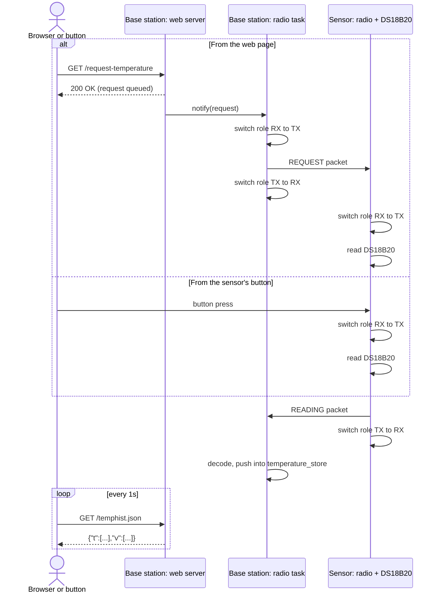
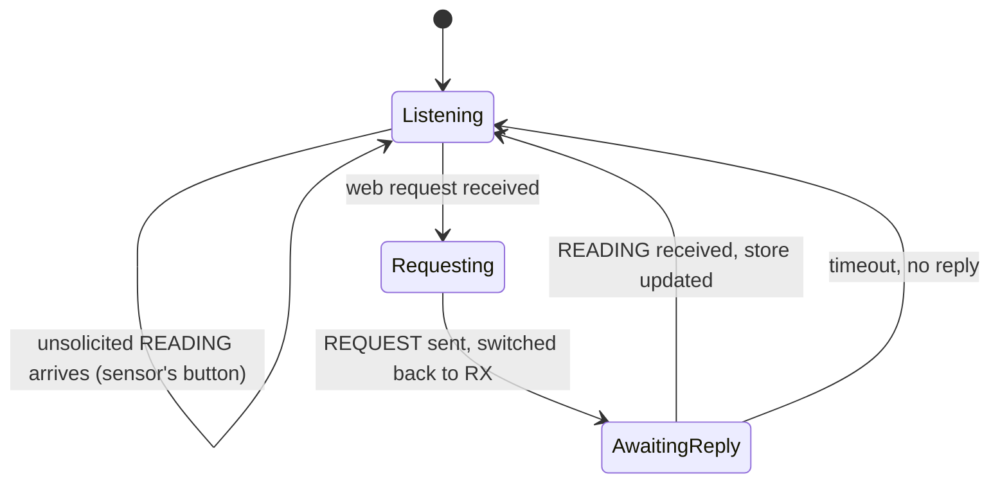
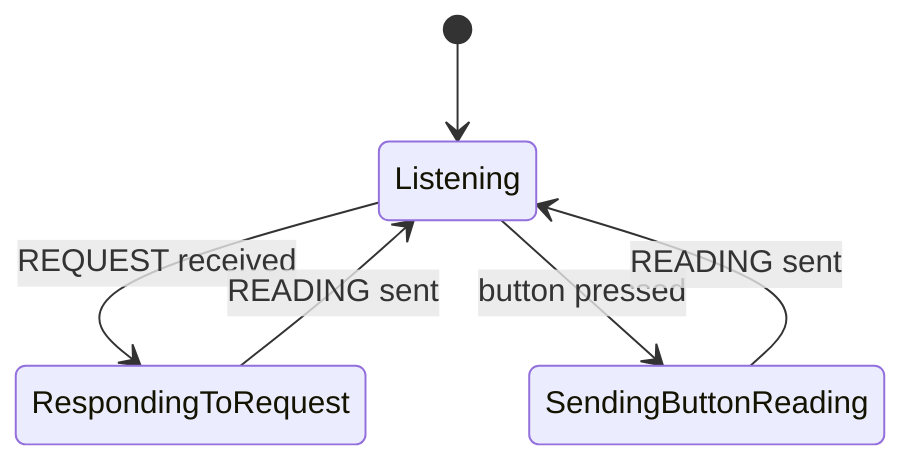
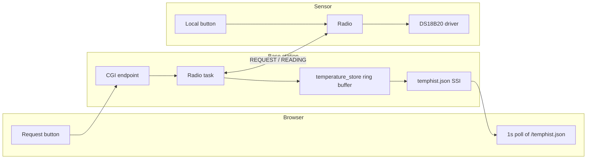

# How It Works

Two boards. The **sensor** reads a DS18B20 temperature sensor and sends a reading over an nRF24L01+ radio link. The **base station** receives it, keeps the last 48 readings, and serves a web page that charts them. A reading reaches the base station one of two ways: the sensor's own push button, or a "Request temperature" click on the web page that asks the sensor for one on demand.

Both radios can transmit and receive and are not locked into a single role. Each one **defaults to listening** and only switches to transmit for the brief moment it takes to send a packet, then switches back. This makes an on-demand request possible.

## Getting a reading, one way or another

Whichever one triggers it (the button or the web request), the two boards end up in the same handshake, and the result lands in the same place: the base station's reading history, picked up by the web page's recurring poll.

A request that gets no reply simply times out client-side: the button re-enables itself and nothing is added to the history. Everything else about the system behaves as if that click never happened.

## Radio roles

Switching roles is cheap: flipping the radio between transmit and receive is a single register write, and both boards share one fixed radio address, so no re-addressing is needed either.
**Base station**: always listening; a request is a brief change of state:

**Sensor**: also always listening, so a REQUEST can arrive at any time; the button follows a similar pattern:

## Wire protocol

Every packet starts with a one-byte opcode:

| Field | Type | Meaning |
|---|---|---|
| `opcode` | `uint8_t` | `REQUEST = 0` (base station → sensor, no reading attached) or `READING = 1` (sensor → base station) |
| `temperature_centi_c` | `int16_t` | Hundredths of a degree C; only meaningful when `opcode == READING` |

## System components

Each board owns its radio through a single task, so only one thing ever talks to the radio hardware at a time, and a request never races the code listening for the reply to it.
