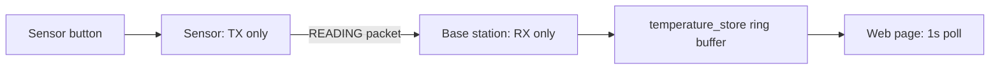
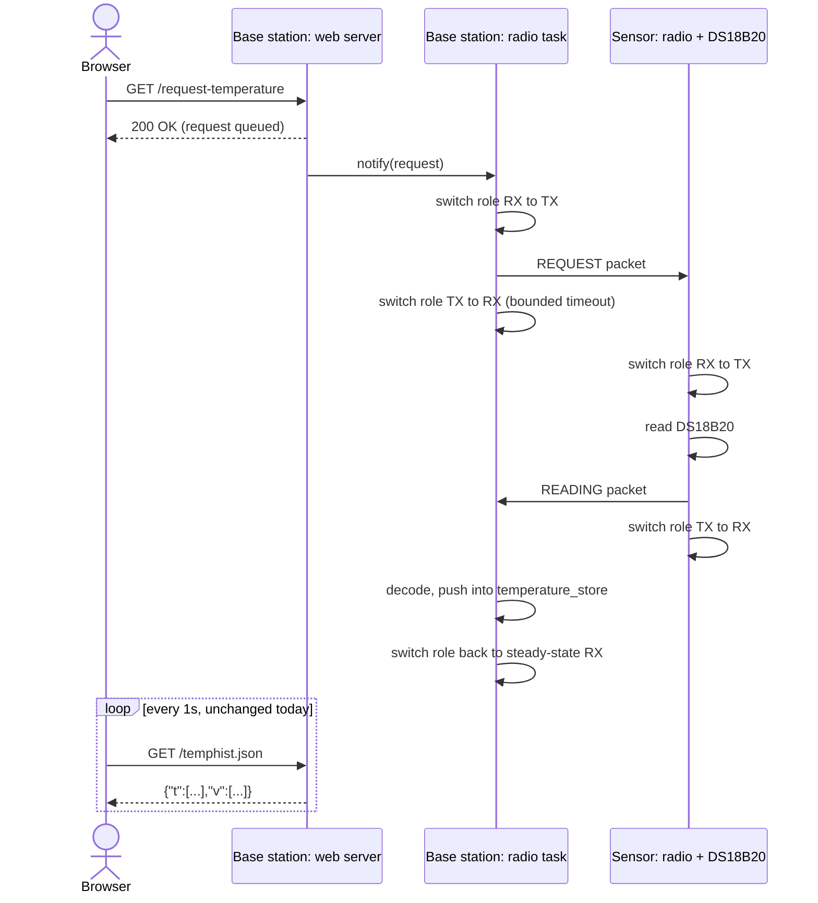
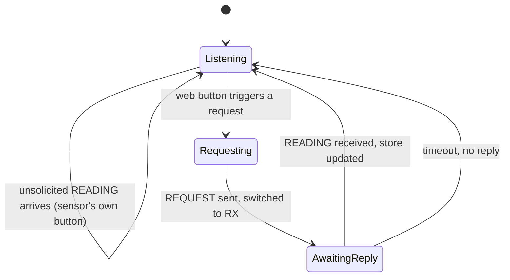
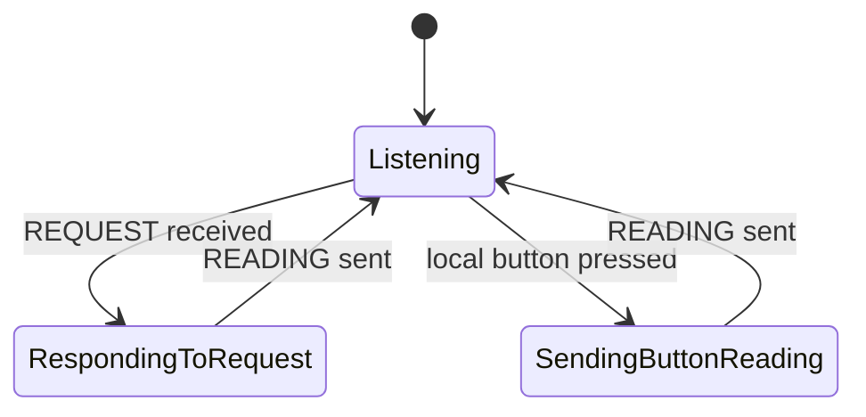
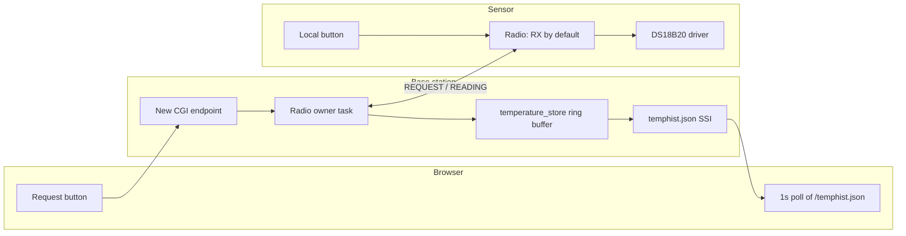

# On-Demand Temperature Request

A conceptual design for a "Request temperature" button on the base station's web page: click it, and the base station asks the sensor for a fresh reading over nRF24 instead of waiting for the sensor's own button or next scheduled push.

No code has been written against this design yet — it captures the architecture and the decisions needed before implementation starts.

## Today's system

The two radios are each hard-wired to a single role for their entire lifetime:

- **Sensor** (`sensor/nrf24l01/temperature_sender.c`) — `NRF24L01_TEMPERATURE_TYPE_TX` only. It transmits a reading when its local button is pressed, and never listens.
- **Base station** (`base_station/temperature/temperature_receiver.c`) — `NRF24L01_TEMPERATURE_TYPE_RX` only. It listens passively and never transmits.

This one-way flow is what the ring buffer and the web page's chart already rely on today — that part doesn't change.

## Why this needs real bidirectional roles

For the base station to *ask* the sensor for a reading, the sensor has to be listening at a moment it didn't itself choose — so the sensor needs an RX capability it doesn't have today, and the base station needs a TX capability it doesn't have today.

The nRF24L01's ack-payload feature (piggybacking data on an auto-ack) was considered as a lighter-weight alternative, but it doesn't fit: ack-payloads only ride along on a reply to a transmission the *other* side already initiated. Here, the exchange has to start with the base station calling out unprompted, so piggybacking can't carry the request itself. Genuine role-switching is the only option that fits.

The underlying primitive is cheap, though: `nrf24l01_set_mode()` in the low-level driver is a single register write, and both ends already share one fixed radio address — so switching roles doesn't require re-addressing, only a role-switch operation that the higher-level `driver_nrf24l01_temperature.c` wrapper doesn't expose yet (today it fixes the mode once, at `init()`).

## Proposed flow

The last leg is free: a requested reading lands in `temperature_store` exactly like any other, so the page's existing 1-second poll of `/temphist.json` is what actually reveals it. No new client-side rendering path is needed.

## Radio role state machines

**Base station** — steady state is unchanged (always listening); a request is a bounded detour:

**Sensor** — steady state flips from always-TX to always-RX, so it can be called on demand; the local button still works the same way it does today:

## Protocol change

The payload grows from a bare temperature value to an opcode-tagged message. Dynamic payload length is already enabled at the radio config level but unused — this is what it's for:

| Field | Type | Meaning |
|---|---|---|
| `opcode` | `uint8_t` | `REQUEST = 0` (base station to sensor, no reading attached) or `READING = 1` (sensor to base station, same meaning as today's only packet) |
| `temperature_centi_c` | `int16_t` | Hundredths of a degree C; only meaningful when `opcode == READING` |

Both ends must move to this wire format simultaneously — there's no wire-compatible middle step.

## Components touched

Only one task may own the radio/SPI bus at a time on either board. Rather than adding a second task that races the existing receiver task, that task's responsibility grows to include the bounded request/response detour above — radio ownership stays single-threaded.

## Decisions confirmed

| Question | Decision | Reasoning |
|---|---|---|
| Should the sensor's steady state become RX (listening) by default? | **Yes** | Simplest, symmetric design; the sensor's own button-triggered send still works as a brief RX→TX→RX round trip on top of it. |
| Should the web request block until the sensor replies? | **No — fire-and-forget** | The CGI handler returns immediately once the request is queued; the existing 1s poll surfaces the outcome (or its absence, on timeout) without tying up an httpd connection for the radio round-trip. |

## Open items for implementation

- Add a runtime PTX/PRX role-switch operation to `driver_nrf24l01_temperature.c` (today mode is fixed at `init()`).
- Extend the payload struct and `nrf24l01_temperature_decode()` to carry and validate the new `opcode` field.
- Sensor: flip default role to RX, handle `REQUEST` by reading DS18B20 and replying with `READING`, keep the existing button path working.
- Base station: extend the radio-owner task with the bounded request/response detour and a timeout.
- Web server: add a CGI/GET endpoint (e.g. `/request-temperature`) that signals the radio task and returns immediately.
- Web page: add the button, disable it client-side until the array changes or a short timeout elapses, so repeated clicks can't queue overlapping radio requests.
- Decide and surface a "no response" indicator in the UI for the timeout case, so a missed request isn't silently invisible.
